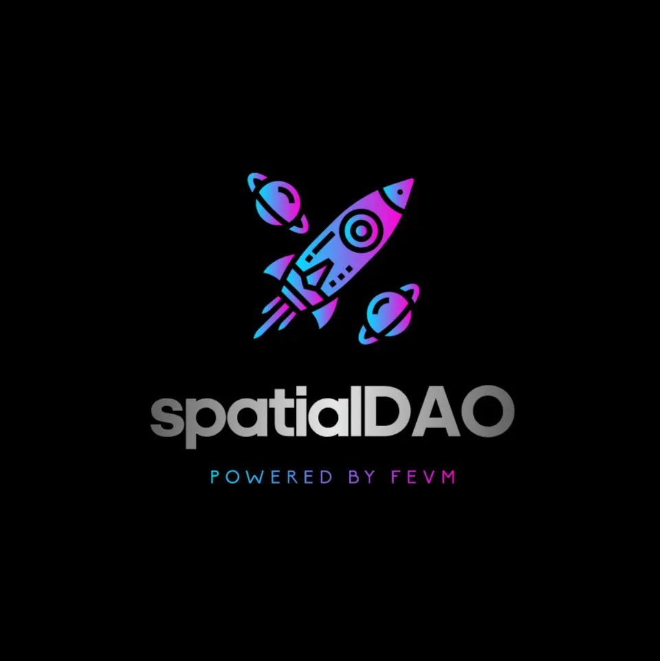

<h1>
 Welcome to spatialDAO
</h1>

SpatialDAO is a platform that enables organizations to create and monetize their own dataDAOs (Decentralized Autonomous Organizations) using the Filecoin Ethereum Virtual Machine (FEVM). The platform operates on a bounty philosophy, where each organization has a set of proposers, voters, and administrators. Administrators can add or remove proposers, proposers can create proposals for data storage, and voters can vote on the importance of the data. If a proposal is accepted, proposers can create bounties to fund the storage of that data. Bounties can only be created for successfully voted files, and they keep information about the bounty reward and the number of bounties the organization will offer for that file. Deal clients in the Filecoin ecosystem can search for bounties, create storage deals for the files that have bounties, and claim bounties once the dataDAO contract verifies that the storage deal has been made on the network. The SpatialDAO offers a social layer that utilizes Orbis.club that is operating on the Ceramic network to allow organizations to explore proposals and bounties, as well as providing a communication layer for its members.
