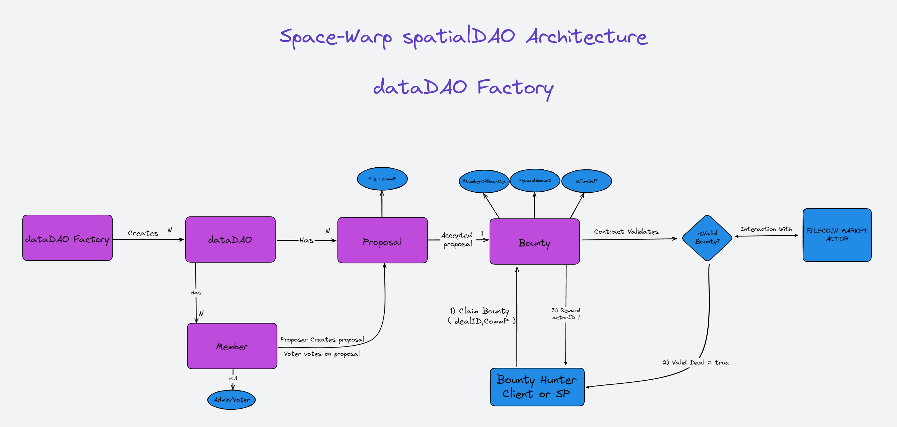

<h1>
 Welcome to spatialDAO
</h1>

Our application is hosted on IPFS using Spheron.
 * [Spheron dapp link](https://spatialdao.live/)

Authors
 * [nijoe1](https://github.com/nijoe1)
 * [Suhel-Kap](https://github.com/Suhel-Kap)

## Short Description

SpatialDAO is a dataDAO Factory that allows created dataDAOs in the platform to make file proposals and bounties for specific commitment pieces. Deal clients, on the other hand, are hunting bounties and making storage deals for DAO-proposed data and getting rewarded for that!
 

## Long Description
SpatialDAO is a platform that enables organizations to create and monetize their own dataDAOs (Decentralized Autonomous Organizations) using the Filecoin Ethereum Virtual Machine (FEVM). The platform operates on a bounty philosophy, where each organization has a set of proposers, voters, and administrators. Administrators can add or remove proposers, proposers can create proposals for data storage, and voters can vote on the importance of the data. If a proposal is accepted, proposers can create bounties to fund the storage of that data. Bounties can only be created for successfully voted files, and they keep information about the bounty reward and the number of bounties the organization will offer for that file. Deal clients in the Filecoin ecosystem can search for bounties, create storage deals for the files that have bounties, and claim bounties once the dataDAO contract verifies that the storage deal has been made on the network. The SpatialDAO offers a social layer that utilizes Orbis.club that is operating on the Ceramic network to allow organizations to explore proposals and bounties, as well as providing a communication layer for its members.

 ## ARCHITECTURE

 
# Technologies Used

 
This is how we used the FEVM hyperspace testnet - Spheron || NFT.Storage - Orbis SDK
 
 
  
   **Our FEVM dataDAOFactory and dataDAO Contracts** 
     
        We created fully complied contracts using the Zondax and OpenZeppelin standards. The contracts are extended version of the dealRewarded contract You can find the contracts in those links: 
         
        **Here is the contract folder**
         
        **https://github.com/nijoe1/spatialDAO/tree/main/spaceWarpContracts/contracts**
 
 
   **Orbis SDK** 
     
       The spatialDAO uses the orbis SDK, built on the Ceramic network, to power its decentralized social platform. Orbis provides us user profiles, posts, and one social space for each dataDAO for communication and collaboration between the DAO members. All of this information is stored on the Ceramic network to ensure a decentralized and secure environment. Orbis plays a key role in enabling The spatialDAO to function as a decentralized social platform and provide a range of features for users to connect and engage with dataDAO communities in a scalable and decentralized way.
          
          
  **Spheron & NFT.STORAGE**
      
       Our application interface is hosted using Spheron to the IPFS network.
        
       All the metadata files for each user and each dataDAO are stored on the IPFS network using NFT.STORAGE
       The code snippets that are using NFT.STORAGE modules are located here:
        
       https://github.com/nijoe1/spatialDAO/blob/main/web-interface/hooks/useNftStorage.ts
        
     
   
  ## SmartContracts
  Our contract is deployed on FEVM HyperSpace Testnet here is the contract glif explorer Link. 
    You can use the spacialDAO.abi.json and contractFactory.abi.json that are on the below links to check in the explorer the interactions and the method names
   
  https://github.com/nijoe1/spatialDAO/blob/main/web-interface/constants/factory.abi.json
   
  https://github.com/nijoe1/spatialDAO/blob/main/web-interface/constants/spatialdao.abi.json
 
One of many dataDAO contract :
 https://explorer.glif.io/address/0xD5eD553EAFf3decDCc25D237e3F31F74b379F0ED/?network=hyperspacenet
 
Here is a succesfull client bounty claim recorded on the glif explorer : https://explorer.glif.io/tx/bafy2bzaceagcsrthxvkh2lhygf5hrioa4wdplzmkibxv34ajhqiwu5ms2yp54/?network=hyperspacenet  
 That transaction shows the last step of undertanding that everything works!
 
daoFactoryContract : 
 https://explorer.glif.io/address/0xAF454A764dC42c6D1e835c04D318671203aD9b78/?network=hyperspacenet
 
The useContract is located here : 
  https://github.com/nijoe1/spatialDAO/blob/main/web-interface/hooks/useContract.ts
 

to run on localhost just run

**yarn install**
**yarn dev**

